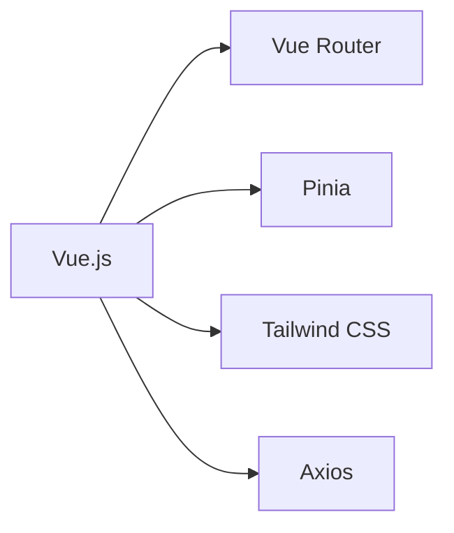
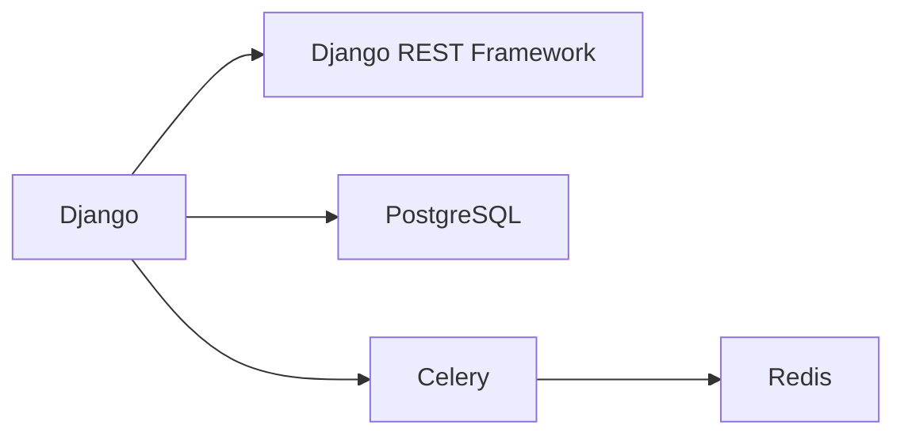

# Cleanzio 🌿 

<div align="center">

[](https://choosealicense.com/licenses/mit/)
[](https://www.python.org/downloads/)
[](https://vuejs.org/)
[](https://www.djangoproject.com/)
[](https://www.docker.com/)
[](https://tailwindcss.com/)


</div>

## 🌟 About Cleanzio

Cleanzio is your ultimate solution for maintaining pristine hygiene standards in restaurants and food courts. We combine powerful technology with intuitive design to create a comprehensive hygiene management system that works for everyone.

### 🎯 Why Choose Cleanzio?

- **Real-time Monitoring** - Track cleanliness metrics as they happen
- **Smart Notifications** - Never miss critical hygiene tasks
- **Data-Driven Insights** - Make informed decisions with advanced analytics
- **User-Friendly Interface** - Intuitive design for all skill levels
- **Compliance Ready** - Stay ahead of health regulations

## ✨ Features

<details>
<summary>🧹 Hygiene Task Management</summary>
<br>
- Create and assign tasks with deadlines
- Track completion status in real-time
- Set recurring tasks for routine maintenance
- Priority-based task organization
</details>

<details>
<summary>📋 Inspection Reports</summary>
<br>
- Customizable inspection templates
- Photo documentation support
- Digital signature capability
- Automated report generation
</details>

<details>
<summary>📊 Analytics Dashboard</summary>
<br>
- Real-time hygiene metrics
- Customizable KPI tracking
- Trend analysis and forecasting
- Export capabilities for reporting
</details>

## 🛠️ Tech Stack

### Frontend


### Backend


## 🚀 Quick Start

### Prerequisites

```bash
# Check Python version
python --version  # Should be 3.x

# Check Node.js version
node --version   # Should be 14.x or higher

# Check npm version
npm --version    # Should be 6.x or higher
```

### One-Click Setup (with Docker) 🐳

```bash
# Clone the repository
git clone https://github.com/bhargavvz/cleanzio.git

# Navigate to project directory
cd cleanzio

# Start with Docker Compose
docker-compose up --build
```

### Manual Setup

<details>
<summary>View detailed setup instructions</summary>

#### Backend Setup
```bash
# Navigate to backend directory
cd backend

# Create virtual environment
python -m venv venv
source venv/bin/activate  # On Windows: venv\Scripts\activate

# Install dependencies
pip install -r requirements.txt

# Run migrations
python manage.py migrate

# Start server
python manage.py runserver
```

#### Frontend Setup
```bash
# Navigate to frontend directory
cd frontend

# Install dependencies
npm install

# Start development server
npm run serve
```
</details>

## 📝 API Documentation

Access our interactive API documentation at `/api/docs/` when running the server locally. Here's a quick overview:

| Endpoint | Method | Description |
|----------|--------|-------------|
| `/api/tasks/` | GET | List all tasks |
| `/api/tasks/` | POST | Create new task |
| `/api/feedback/` | GET | Get all feedback |
| `/api/reports/` | GET | Generate reports |

## 🤝 Contributing

We love contributions! Here's how you can help:

1. Fork the repository
2. Create your feature branch (`git checkout -b feature/AmazingFeature`)
3. Commit your changes (`git commit -m 'Add some AmazingFeature'`)
4. Push to the branch (`git push origin feature/AmazingFeature`)
5. Open a Pull Request

See our [Contributing Guidelines](CONTRIBUTING.md) for more details.

## 📜 License

Distributed under the MIT License. See `LICENSE` for more information.

## 🙏 Acknowledgments

- [Vue.js](https://vuejs.org/)
- [Django](https://www.djangoproject.com/)
- [Tailwind CSS](https://tailwindcss.com/)
- [PostgreSQL](https://www.postgresql.org/)

---

<div align="center">

Made with ❤️ by [Bhargav Adepu](https://github.com/bhargavvz)

⭐️ Star us on GitHub — it helps!

</div>
